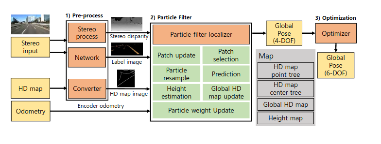

<!--
 * @FilePath: Pf_HDLoc.md
 * @Author: Taber.wu
 * @Date: 2022-10-18 09:37:39
 * @LastEditors: Please set LastEditors
 * @LastEditTime: 2022-10-26 23:43:16
 * Copyright: 2022 JOYSON CO.,LTD. All Rights Reserved.
 * @Descripttion: 
-->
# HDMI-Loc: Exploiting High Definition Map Image for Precise Localization via Bitwise Particle Filter

## 关键词：
***6-DOF localization、8-bit representation for road information、高精度语义地图***   

## 方法:
论文中采用矢量地图(主要包括车道线、停止线、路边方向标识牌和路面标识)、深度相机感知数据和轮速计(编码盘差速轮模型)，主要分为3个步骤（系统架构图如下）:
1.   分割深度相机带有语义标签图像与高精度地图图像文件预处理；
2.   采用粒子滤波方法对感知的patch与高精度的tile匹配估计4D位姿（位置和航向角）
3.   通过对roll和pitch进行优化，完成完整的6D位姿估计
  
### A: 符号定义 
### B: 高精度地图预处理与8bit含义
 高精度地图预处理实现将地图矢量数据转换成8bit图像文件(称为tile),并建立搜索树(用于自车位姿附近的tile搜索)。高精度地图预处理在主进程之前运行一次。  
1. 高精度地图->8bit图像tiles：    
   tiles的8bit像素高三位分别作为车道、停止线、标识的标志位； 然后按照设定的地图大小($l_{map}=30$)进行分割并与其分块中心的UTM坐标一同存储；  
   类似的将带有高度信息的高精度地图数据转换成32bit图像一同存储。  
2. 高精度地图tiles搜索树的建立：  
   在预处理过程中分别以tile的中心UTM坐标建立图像中心搜索树（用以快速搜索自车位姿附近的高精度地图）和 基于原始高精度地图图像文件数据的点树(用于高度估计数据搜索)
3.  深度图像->标签化点云：
   采用DL方法（DeepLabv3+ CNN）从深度图得到带语义标签的点云图。  
4.  标签化点云->子patch:    
   从鸟瞰图视角(从z轴)将标签化的点云投影并按照同样的8bit像素的定义，生成子patch，并多个子patch（论文中取$l_{patch}=5$）拓展合并成patch。所有的的patch包含中心点(最新一帧自车全局位姿)和 中心点相对于上一个patch的位姿变换。
### C: patch 维护
定义的8bit像素 patch-tile的匹配避免了逐像素的无效匹配，随着patch 的更新和选择，能够高效实现搞笑的动态匹配。
1. patch 更新：
    对于新的子patch，首先将标签化的点云转化到全局坐标系：  
    $$^G P_{S,t}=T^G_VT^V_S{^SP_{S,t}}$$ 
    然后将转换后的点云投影到patch图像坐标系(包含语义标签信息,  其中$^{P_0}P^{(k)}=\{u^{(k)},v^{(k)},l^{(k)}\}$)：  
    $${^{P_0}}P=\pi_0({^GP_{S,t}})$$  
    当patch 的长度大于设定的$l_{patch}$,通过比例$\alpha$缩小生成新的patch:  
    $$a_{p_i}=\alpha a_{p_{i-1}}$$
2. patch 选择：  
   本文通过对patch中单位长度车道线像素点数、停止线像素点数和标识像素点的加权求和，得到一个权重最高的patch作为匹配对象从而优化匹配效率，文中各种情况下三种像素点和的权重设置为：  
   $$\begin{aligned}
   & (\xi_{lane1},\xi_{stop1},\xi_{sign1})=(12,40,50) \\
   & (\xi_{lane2},\xi_{stop2})=(10,70) \\
   & (\xi_{lane_{min}})=(10)
   \end{aligned}$$
### D: bit维度粒子滤波  
在已知精确初始定位的前提下，生成的粒子二维位姿$(t_x,t_y,r_z)$ 包含三个状态量来作为最临近时刻的patch的中心坐标，其对应的全局坐标可以通过保存的相对位姿变换得到。由于粒子的数量与参与匹配的patch数相关，所以在更新粒子权重前需要根据选择的patch进行重采样。  
1. 粒子重采样： 
   最佳patch距离越近，参与匹配的patch越少，更多的粒子放到当前patch中，从而提高位姿精度：  
   $$n_{patch}=min(n_{min}\frac{l_{max}}{n_{patch}\cdot l_{patch}},n_{max})$$ 
   文中对应参数设置为：  
   $$\begin{aligned}
   & n_{min}=50 \\
   & n_{max}=2000 \\
   & l_{patch}=5 \\
   & l_{max}=100
   \end{aligned}$$
2. 粒子预测：  
   采用匀速运动模型并添加高斯噪声预测更新粒子二维位姿状态；  
3. 创建候选tile集：
   通过B2中建立的tile中心点树快速查询读入粒子位姿最邻近高精度地图tile数据，从创建用于匹配的tile
4. 粒子权重更新： 
    首先根据粒子姿态角与里程计的航向角差值对patch绕中心坐标进行旋转平移：  
    $$\hat{I}_{p_i}=t(c_{p_i})r(\hat{\theta}_{p_i}-\theta _{p_i})t(-c_{p_i})I_{p_i}$$
    然后对patch和tile图像进行**与**操作得到匹配之后的图像：  
    $$I_{M,p_i}=AND(I_G,\hat{I}_{p_i})$$
    最后根据**与**后图像中车道线、停止线、标识的像素点加权乘以patch的放缩比例得求和到粒子匹配的权重：  
    $$w_t^{(k)}=\sum ^{n_{patch}}_{i=0}a_{p_i}(w_l n_{l,p_i}+w_s n_{s,p_i}+w_m n_{m,p_i})$$
5. 姿态的高度估计：  
   采用更新权重最高的3%粒子的平均位姿作为二维位姿的估计，再利用B2中建立高精度地图图像文件原始数据树查询二维位姿的估计最邻近的高度值作为高度的更新值。  
### E:优化 
对于6D位姿中的roll和pitch，利用深度相机关于道路平面点云与高精度地图中道路平面数据进行估计优化。  
首先提取深度相机图像中道路平面的点云并转换到自车坐标系下： 
$$^VP_{S,t}=T^V_S{^SP_{S,t}}$$
然后采用RANSAC方法拟合出道路平面方程：  
$$^Vn_t=\{ {^Vn_{t,x}}, {^Vn_{t,y}}, {^Vn_{t,z}}, {^Vd_t} \}$$
式中${^Vn_{t,x}}, {^Vn_{t,y}}, {^Vn_{t,z}}, {^Vd_t}$分别表示平面法向量在3轴的分量和平面的常数项。
最后固定D中得到的三位位置与航向角的估计$(t_x,t_y,t_z,r_z)$,采用LM方法根据高精度地图道路平面与感知的的重投影误差优化rool和pitch ,从而完成6D位姿的优化估计:  
$$^VP_{map}=\bar{T}^V_G{^GP_{map}} \\
r^*_x,r^*_y= \underbrace{argmin}_{r^*_x,r^*_y}\sum ^N_{k=0}({^Vn_t}\cdot {^VP^{(k)}_{map}})
$$  
## 疑问:
1. 文中高精度地图数据是基于图像文件，对于矢量数据的高精度地图如何适配该方法？
2. 文中采用粒子滤波时，同时对二维姿态的三个变量同时施加高斯噪声，此时高斯噪声的方差该如何设计调节？因而造成的粒子数量是否过多？能否再分开估计？