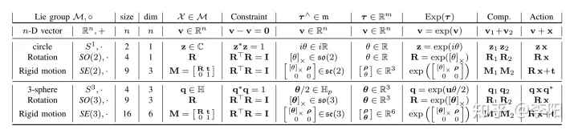

<!--
 * @FilePath: eskf推导.md
 * @Author: Taber.wu
 * @Date: 2023-02-23 13:14:24
 * @LastEditors: Please set LastEditors
 * @LastEditTime: 2023-02-23 13:43:52
 * Copyright: .
 * @Descripttion: 
-->
# SO(3)上的ESKF推导
## 优势：
1. ESKF总是在原点附近，离奇异点较远，并且也不会由于离工作点太远而导致线性化近似不够的问题。
2. 误差状态的运动学也相比原状态变量要来得更小，因为我们可以把大量更新部分放到原状态变量中。
3. ESKF的状态量为小量，其二阶变量相对来说可以忽略。同时大多数雅可比矩阵在小量情况下变得非常简单，甚至可以用单位阵代替。
4. 在旋转的处理上，ESKF的状态变量可以采用最小化的参数表达$\delta \theta$，也就是使用三维变量来表达旋转的增量。而传统KF需要用到四元数（4维）或者更高维的表达（旋转矩阵，9维），要不就得采用带有奇异性的表达方式（欧拉角）
   
## 预备知识
### 李群变换
常见的李群变换 
推导：  
    对于3×3的旋转矩阵$R$有：  
$$RR^T = I$$
 对两边求导得到：
 
