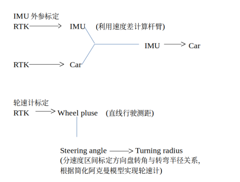
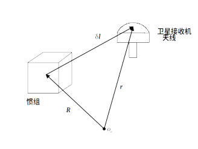
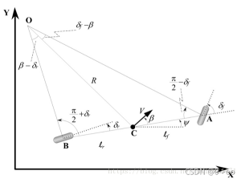
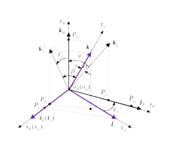
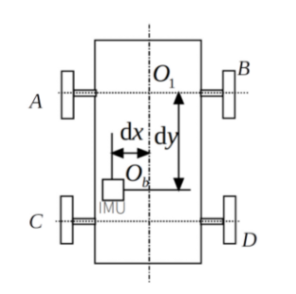

<!--
 * @Author: wuyuyang 
 * @Date: 2022-09-20 08:51:07
 * @LastEditors: Please set LastEditors
 * @LastEditTime: 2022-09-28 16:34:55
 * @FilePath: imu标定.md
-->
# imu外参及轮速计标定
所有标定流程考虑以RTK作为真值，其过程如图：   
  

## 1.0 RTK-Car
***问题:***  
主从天线与车辆关系及相关配置是否已经实现？

## 1.1 RTK-IMU杆臂标定
假设IMU中心相对于地心向量$R$,RTK天线相对于地心向量$r$，需要标定杆臂向量$\delta l$，其关系$\quad r=R+\delta l\quad\qquad$   如下图所示：

假设标定完内参后，IMU与RTK坐标系平行，对上述关系式两边求导，可以近似得到：  
$$V_{RTK}^n=V_{imu}^n+C_b^n (\omega_{eb}\times \delta l^b) \tag{1-1}
$$
据此式分别采集多组RTK与imu速度值，计算杆臂   
   
        
***注：***  
严老师方案中，对式1-1将杆臂投影到ENU坐标系下，利用RTK直接观测的lla进行计算：  
$$P_{imu}-P_{RTK}=-M_{pv}C_b^n\delta l^b$$

## 1.2 轮速计
之前用的一种简化阿克曼的轮速计模型（又称自行车模型），将车辆简化为平均转向轮A和平均非转向轮B，如下图所示：  
进行运动学分解后，可以得到航向角与转向轮角度的关系：  
$$\psi '=\frac{V\cos \beta}{l_f+l_r}(\tan \delta_f-\tan \delta_r)
$$
在假设非转向轮（后轮）无转角下($\delta_r=0$)情况下，分别标定车速V与底盘数据（轮速脉冲||轮速）关系，及方向盘转角与转向轮关系，即可实现轮速计。

## 1.3误差

### 1.3.0非直角坐标系<->直角坐标系矩阵变换
直角坐标系$O_bX_bY_bZ_b$(简称b系)其坐标轴单位矢量分别为$i_b,j_b,k_b$,  
非直角坐标系$O_aX_aY_aZ_a$(简称a系)其坐标轴单位矢量分别为$i_a,j_a,k_a$,  
假设b系与a系具有共同的坐标原点，则a系到b系坐标变换矩阵可以表示为：  
 
$$ 
C_a^b =
\left[
\begin{matrix}
i_b\cdot i_a &i_b \cdot j_a &i_b \cdot k_a \\
j_b\cdot j_a &j_b \cdot j_a &j_b \cdot k_a \\
k_b\cdot i_a &k_b \cdot j_a &k_b \cdot k_a
\end{matrix}
\right] 
\\ =
\left[
\begin{matrix}
\sqrt{1-p_{yx}^2-p_{zx}^2} &p_{xy} &p_{xz} \\
p_{yx} &\sqrt{1-p_{xy}^2-p_{zy}^2} &p_{yz} \\
p_{zx} &p_{zy} &\sqrt{1-p_{xz}^2-p_{yz}^2}
\end{matrix}
\right] 
\tag{3-1}
$$
b系与a系对应轴向不平行偏差较小时式（1-1）近似为：
$$ 
C_a^b \approx
\left[
\begin{matrix}
1 &p_{xy} &p_{xz} \\
p_{yx} &1 &p_{yz} \\
p_{zx} &p_{zy} &1
\end{matrix}
\right] 
\tag{3-2}
$$   

根据QR分解方法将式（1-2）可以唯一分解为正交阵$C_B^b$与对角线元素全为正上三角阵$C_a^B$乘积：    
$$C_a^b=C_B^bC_a^B \tag{3-3}$$  
对式(1-3)可以分步看成从b系到B系按照正交阵$C_B^b$坐标变换(1)，记b系到B系等效旋转矢量为$\boldsymbol{\mu}=[\mu_x\quad \mu_y \quad \mu_z]^T$(其中$\mu=\sqrt{\boldsymbol{\mu}^T \boldsymbol{\mu}}$),则$C_B^b$ 可以近似为：    
$$\begin{aligned}
C_B^b &=I+\frac{\sin \mu}{\mu}(\boldsymbol{\mu} \times) +\frac{1-\cos^2\mu}{\mu^2} (\boldsymbol{\mu} \times)^2 \\
&\approx I+(\boldsymbol{\mu} \times)  \tag{3-4}
\end{aligned}$$  

再按照$C_a^B$ 从非直角坐标系a到直角坐标系B的变换 如图  
其中记a系到B系的偏差角$\boldsymbol{\varphi}=[\varphi_x\quad \varphi_y \quad \varphi_z]^T$,则$C_a^B$可以近似为：
$$C_a^B \approx
\left[
\begin{matrix}
1 &\varphi_z &\varphi_y \\
0 &1 &\varphi_x \\
0 &0 &1
\end{matrix}
\right] 
\\= I+\boldsymbol{\varphi}^{\Delta}
\tag{3-5}$$

对式1-4和式1-5带入1-3并略去二阶小量可得：  
$$\begin{aligned}
C_a^b &=(I+\boldsymbol{\mu} \times)(I+\boldsymbol{\varphi}^{\Delta}) \\
&\approx I+(\boldsymbol{\mu} \times)+\boldsymbol{\varphi}^{\Delta}
\end{aligned}
\tag{3-6}$$ 

### 1.1.2 imu与后轴中心位置偏差  
捷联惯组安装在车体上时，惯组测量中心与车辆后轴中心存在偏差(如下图所示)  

  

