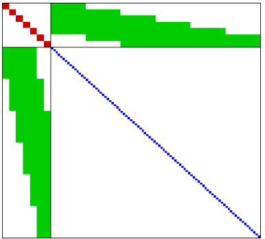
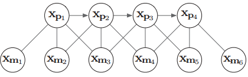
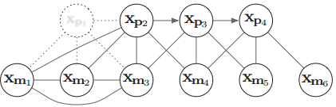
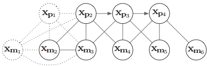
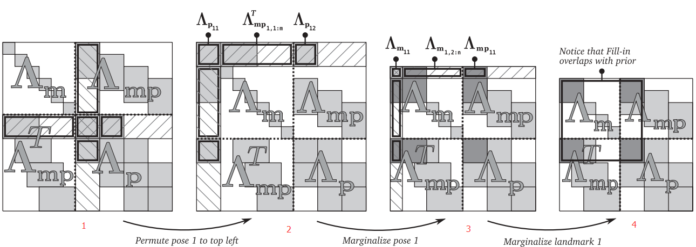

<!--
 * @FilePath: slam.md
 * @Author: Taber.wu
 * @Date: 2023-07-17 09:44:22
 * @LastEditors: Please set LastEditors
 * @LastEditTime: 2023-07-17 14:10:24
 * Copyright: 2023 JOYSON CO.,LTD. All Rights Reserved.
 * @Descripttion: 
-->
## marginalization(边缘化)
### 目的：
   ****
优化维持BA计算量，利用最小二乘求联合分布的子集滑动窗口中的图优化。  

### 方法：
求解Schur complement（舍尔补）做分割消元，实现边缘化。  

$$
\left[
\begin{matrix}
\Lambda_a   &\Lambda_b\\
\Lambda_b^T &\Lambda_c
\end{matrix}
\right] 
\left[
\begin{matrix}
\delta x_a\\
\delta x_b
\end{matrix}
\right] =
\left[
\begin{matrix}
g_a\\
g_b
\end{matrix}
\right]
$$
对x$_a$进行边缘化消元得到：  
$$
\left[
\begin{matrix}
\Lambda_a   &\Lambda_b\\
0 &\Lambda_c-\Lambda_b^T \Lambda _a^{-1} \Lambda_b
\end{matrix}
\right] 
\left[
\begin{matrix}
\delta x_a\\
\delta x_b
\end{matrix}
\right] =
\left[
\begin{matrix}
g_a\\
g_b - \Lambda_b^T \Lambda _a^{-1} g_a
\end{matrix}
\right]
$$

### 实现：
BA的Hessian矩阵左上角规定是是雅克比对pose求导并对应相乘;右下角是和特征点相关的;绿色部分是pose和landmark之间交叉的  
  

假设有四个相机pose，以及6个特征点 x m x_m xm​，每个pose观测到三个特征点landmark，图关系如下：  

当pose1需要被marg时，与其相关的$x_{m_1},x_{m_2},x_{m_3}及x_{p_2}$进行线性组合并消去$x_{p_1}$得到：  
  
此时相关约束体现在$x_{m_1}$与其余pose和mark的边上，当mark1需要被marg时，我们要marg那些不被其他帧观测到的特征点。因为他们不会显著的使得H变得稠密。对于那些被其他帧观测到的特征点，要么就别设置为marg，要么就宁愿丢弃,因为迭代过程中，状态变量会被不断更新，计算雅克比时我们要fix the linearization point。 所谓linearization point就是线性化时的状态变量，即求雅克比时的变量，因为计算雅克比是为了泰勒展开对方程进行线性化。我们要固定在点x0(marg 时的状态变量)附近去计算雅克比，而不是每次迭代更新以后的x。(marg 不被其他帧观测到的mark如下图：)   
    

Hessian矩阵的变化如下图：  

