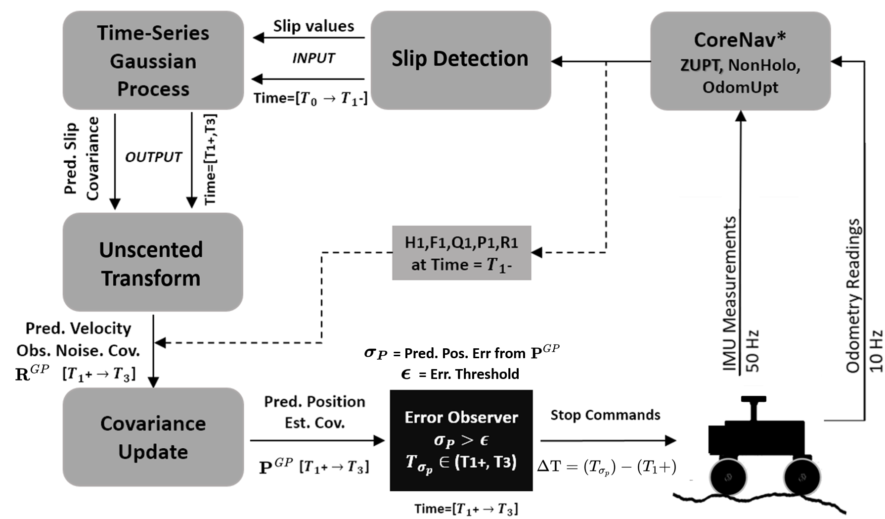

<!--
 * @FilePath: 零速修正(ZUPT).md
 * @Author: Taber.wu
 * @Date: 2022-09-28 14:09:05
 * @LastEditors: Please set LastEditors
 * @LastEditTime: 2022-09-29 08:18:38
 * @Descripttion: 
-->
# 零速修正
***零速修正(Zero Velocity Update, ZUPT)***  
当载体处于静止状态时，载体此时的速度为零，利用载体中的惯性系统的解算速度作为系统速度误差的观测量，对其他误差量进行修正，改善静止状态下的组合导航结果，不需要增加外部传感器，因而是一种有效且廉价易实现的技术。常用的零速修正估计算法为：曲线拟合法和卡尔曼滤波法，曲线拟合法虽然相对简单，但修正间隔短且修正时间长，因此通常采用卡尔曼滤波法进行零速修正估计。当检测到载体处于静止状态时，利用SINS子系统解算的速度作为系统速度误差的观测量，进行卡尔曼滤波估计，利用更新后的状态估计值反馈校正SINS子系统内部的导航参数误差，完成静态零速修正。
## 零速状态判断准则
* ***加速度幅值检测:*** 载体处于静止状态时，惯性测量器件中加速度计的三轴输出矢量和应稳定在当地重力加速度值附近，通过设定比力阈值检测零速状态。
* ***加速度滑动方差检测:*** 载体处于静止状态时，惯性测量器件中加速度计三个轴的输出值的方差应该近似于0，，设置一定大小的滑动窗口，通过比力方差阈值对加速度计三个轴分别检测零速状态。
* ***角速度幅值检测:*** 同加速度幅值检测，载体处于静止状态时，惯性测量器件中陀螺仪的三轴输出矢量和应近似为零，通过设定角速率阈值检测零速状态。
* ***角速度滑动方差检测::*** 同加速度滑动方差检测，载体处于静止状态时，惯性测量器件中陀螺仪三个轴的输出值的方差应该近似于0，，设置一定大小的滑动窗口，通过角速率方差阈值对陀螺仪三个轴分别检测零速状态。  
  
***注：*** 以上零速判断都是基于惯导组件自身测量，在车辆上还可以通过轮速或者视觉等感知进行综合判断。  

## 纯惯性组件方法   

* 当车辆静止时，加速度&角速度都是0,所以观测方程：  
$$\boldsymbol{\tilde{Z}}  =
\left[
\begin{matrix}
\boldsymbol{a}-(\boldsymbol{a}_m-\boldsymbol{b}_a- ^{I_k}_G \boldsymbol{R}^Gg-\boldsymbol{n}_a)\\
\boldsymbol{\omega}-(\boldsymbol{\omega}_m-\boldsymbol{b}_g-\boldsymbol{n}_g) \\
\end{matrix}
\right] \\
 = \left[
\begin{matrix}
-(\boldsymbol{a}_m-\boldsymbol{b}_a- ^{I_k}_G \boldsymbol{R}^Gg-\boldsymbol{n}_a)\\
-(\boldsymbol{\omega}_m-\boldsymbol{b}_g-\boldsymbol{n}_g) \\
\end{matrix}
\right] \tag{1-1}$$  

* 计算雅可比  
  对式1-1进行一阶泰勒展开并求偏导可以得到：  
  $$\frac{\partial \boldsymbol{\tilde{Z}}}{\partial ^{I_k}_G \boldsymbol{R}}= 
  \left[ \begin{matrix}
  ^{I_k}_G \boldsymbol{R}^Gg\times  
  \end{matrix}
  \right]\\
  \frac{\partial \boldsymbol{\tilde{Z}}}{\partial \boldsymbol{b}_a}=\frac{\partial \boldsymbol{\tilde{Z}}}{\partial \boldsymbol{b}_g}=-\boldsymbol{I}_{3\times 3}  \tag{1-2}$$  

* 静止状态检测(仅采用惯性组件--卡方分布)  
  $$ 
  \boldsymbol{\tilde{Z}}^T(HPH^T+\alpha R)^{-1}\boldsymbol{\tilde{Z}} < \chi ^2 \tag{1-3}
  $$  
  式1-3中 $P$表示$^{I_k}_G \boldsymbol{R}^G,\boldsymbol{b}_a ,\boldsymbol{b}_g$的协方差;  
  其中，因为k时刻车辆姿态不变，$P$关于$^{I_k}_G \boldsymbol{R}^G$的协方差是常量;  
  而$\boldsymbol{b}_a ,\boldsymbol{b}_g$的协方差需要从k时刻积分到imu测量时刻;  
  实际使用中，考虑到零速时车辆可能存在振动等噪声，需要对imu噪声放大50-100倍。  
* 状态更新  
  执行正常的卡尔曼滤波更新步骤，更新状态协方差  


## 视差检测(Disparity-based Detection--openvins)
对于连续图像，如果特征轨迹之间的视差变化很小时，计算平均视察和阈值，但是环境是动态时，结果会有错误，需要配合以上基于惯性组件的方法一同使用。   
$$\frac{1}{N}\sum^N_{i=0}||uv_{k,i}-uv_{k-1,i}||<\Delta d \tag{1-4}$$

## 代码阅读
***corenav-GP  [源码链接](https://github.com/wvu-navLab/corenav-GP.git)***  
Affiliation: WVU NAVLAB  
代码完整系统架构图：

```
void CoreNav::zeroUpdate(const CoreNav::Vector3 vel, const CoreNav::Vector3 att, const CoreNav::Vector3 llh, CoreNav::Vector15 error_states, Eigen::MatrixXd P, const CoreNav::Vector3 omega_b_ib){
        countZero++;
        CoreNav::Matrix3 Cnb = CoreNav::eul_to_dcm(att[0],att[1],att[2]);
        CoreNav::Vector3 z_zaru;
        CoreNav::Vector3 z_zupt;
        z_zaru = -omega_b_ib.transpose();
        z_zupt = -vel;
        CoreNav::Vector6 z_zero;
        z_zero.segment(0,3) <<z_zaru;
        z_zero.segment(3,3) <<z_zupt;
        K_zero = P * H_zero.transpose() * (H_zero * P * H_zero.transpose() + R_zero).inverse();
        error_states_ = error_states + K_zero * (z_zero  - (H_zero * error_states));
        ins_att_ = CoreNav::dcm_to_eul((Eigen::MatrixXd::Identity(3,3)- CoreNav::skew_symm(error_states_.segment(0,3)))*Cnb.transpose());
        ins_vel_ = vel - error_states_.segment(3,3);
        ins_pos_ = llh - error_states_.segment(6,3);
        error_states_.segment(0,9)<<Eigen::VectorXd::Zero(9);
        P_=(Eigen::MatrixXd::Identity(15,15) - K_zero * H_zero) * P * ( Eigen::MatrixXd::Identity(15,15) - K_zero * H_zero ).transpose() + K_zero * R_zero * K_zero.transpose();

        return;
}
```
