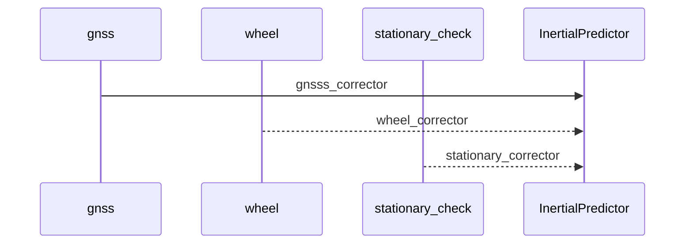

<!--
 * @FilePath: jsslam_readme.md
 * @Author: Taberwu
 * @Version: 2.0
 * @Date: 2024-09-19 19:43:29
 * @LastEditors: Please set LastEditors
 * @LastEditTime: 2024-10-11 19:49:37
 * Copyright: 2024 Taberwu. All Rights Reserved.
 * @Descripttion: 
-->
 [TOC]   

# libjsslam  
libjsslam 定位算法代码仓库  
可以通过修改$./script/build$  中  `PLATFORM`：  
`<86_64_linux aarch64_linux,aarch64_qnx>`生成不同平台的动态库.     
## 目录结构:    
  
<table border="2" >
	<tr >
		<td>目录</td>
		<td colspan="2">主要包含文件</td>
        <td>备注</td>
	</tr>
    <tr >
        <td rowspan="13">applets</td>
        <td rowspan="4">config(配置文件)</td>
        <td>empty.json</td>
        <td>只启动qt可视化,用来标定相关功能 </td>
    </tr>
    <tr >
        <td>J5.json</td>
        <td>使用J5环视外部感知泊车建图定位功能</td>
    </tr>
    <tr >
        <td>joyson_id6.json</td>
        <td>ID6 #4号车 定位功能配置文件</td>
    </tr>
    <tr >
        <td>simulator.json</td>
        <td>仿真imu数据验证定位算法</td>
    </tr>
    <tr >
        <td rowspan="4">dataset(数据集)</td>
        <td>avm_id6_4_2024-07-29</td>
        <td>当前环视拼接标定数据(相机位置有变动)</td>
    </tr>
    <tr >
        <td>surroud_wheel_calib</td>
        <td>环视拼接中心与车辆后轴中心标定数据</td>
    </tr>
    <tr >
        <td>wheel_rtk_calib_id6_4.jsd</td>
        <td>RTK主从天线与车辆后轴中心标定数据</td>
    </tr>
    <tr >
        <td>imu_bsw_calib_id6_4.bag</td>
        <td>ID6 4号车imu内参标定数据</td>
    </tr>
    <tr >
        <td >map(泊车语义地图)</td>
        <td>shanghai.jsm</td>
        <td>上海地下两层地图</td>
    </tr>
    <tr >
        <td rowspan="3">models(模型)</td>
        <td>ddrnet</td>
        <td>语义分割模型</td>
    </tr>
    <tr >
        <td>mixvpr</td>
        <td>图像匹配定位模型(用于全局重定位)</td>
    </tr>
    <tr >
        <td>psd</td>
        <td>库位检测模型</td>
    </tr>
    <tr >
        <td colspan="2">main.cpp</td>
        <td>用于debug生成可执行二进制</td>
    </tr>
    <tr >
        <td >include</td>
        <td td colspan="2">agent.h</td>
        <td>对外接口头文件 </td>
    </tr>
    <tr >
        <td rowspan="60">include_internal/jsslam</td>
        <td rowspan="6">algorithm(通用算法)</td>
        <td> epipolar_geometry.h</td>
        <td> 计算单应矩阵和基础矩阵,选择重投影误差最小初始化单目<br>
        参考orbslam <a href="https://blog.csdn.net/shanpenghui/article/details/110133454" target="_blank" rel="noopener noreferrer">计算原理</a></td>
    </tr>
    <tr >
        <td> gradient_map.h</td>
        <td> 对输入数据离散建立梯度图,用于匹配</td>
    </tr>
    <tr >
        <td> grid_search_align.h</td>
        <td> 撒点,网格匹配</td>
    </tr>
    <tr >
        <td> imu_rectify.h</td>
        <td>  根据标定的 尺度系数,不正交系数和零偏 修正imu测量值</td>
    </tr>
    <tr >
        <td> map_save.h</td>
        <td> 泊车语义地图(关键帧)写文件/读文件</td>
    </tr>
     <tr >
        <td> surround_stitching.h</td>
        <td> 环视图像拼接映射</td>
    </tr>
    <tr >
        <td rowspan="8">calibration(标定)</br>
        标定数据文件备份在工作站目录(sftp://10.100.127.85/media/joy/hdd/slam_group/dataset/joyson/id6/)</td>
        <td> mono_calib.h</td>
        <td> 录取标定板标定数据,识别AprilTag 标定相机内参<br>
        参考AprilTag <a href="https://blog.csdn.net/wangmj_hdu/article/details/111233878" target="_blank" rel="noopener noreferrer">论文实现链接</a></td>
    </tr>
    <tr >
    <td> stereo_calib.h</td>
        <td> 读入双目相机图像数据,标定右相机相对左相机的外参<br>
        参考basalt <a href="https://zhuanlan.zhihu.com/p/447693693" target="_blank" rel="noopener noreferrer">标定原理</a></td>
    </tr>
    <tr >
     <td> surround_calib.h</td>
        <td> 读入四张环视鱼眼图像(PNG格式),手动配置标定特征点世界系和图像坐标文件(例:  <a href="./applets/dataset/avm_id6_4_2024-07-29/config.json" target="_blank" rel="noopener noreferrer">config.json</a>)
    </td>
    </tr> 
    <tr >
    <td> imu_bsm_calib.h</td>
        <td>录取对imu各轴进行静止和转动数据 标定imu的正交系数,尺度系数以及零偏<br>
        加速度计和陀螺采用 <a href="./documents/imu_bsm_model.pdf" target="_blank" rel="noopener noreferrer">参数模型</a></td>
    </tr>
    <tr >
    <td> imu_static_calib.h</td>
        <td>录取对imu静止和转动数据 标定imu的随机游走<br>
        参考 <a href="https://zhuanlan.zhihu.com/p/158927004" target="_blank" rel="noopener noreferrer">allan 方差辨识</a></td>
    </tr>
    <tr >
     <td> cam_imu_calib.h</td>
        <td> 读入 相机内参, 图像数据,imu数据,标定相机相对imu的外参<br>
        使用basalt库 <a href="https://zhuanlan.zhihu.com/p/447693693" target="_blank" rel="noopener noreferrer">基本标定原理</a></td>
    </tr>
    <td> wheel_calib.h</td>
        <td>录取差分定位数据与底盘 轮速,轮速脉冲,方向盘转角数据,手眼标定车辆运动模型到参数<br>
        车辆运动参数 <a href="./documents/wheel_calib.pdf" target="_blank" rel="noopener noreferrer">标定原理</a></td>
    </tr>
    <td> surrounding_wheel_calib.h</td>
        <td>环视拼接中心相对车辆运动模型原点外参标定<br>
       手动填写车辆运动中多个时刻库位角点图像坐标文件(例:<a href="./applets/dataset/surroud_wheel_calib/select_slot_24-04-29.json" target="_blank" rel="noopener noreferrer">select_slot_24-04-29.json</a>) 手眼标定参数</td>
    </tr>
    <tr >
        <td rowspan="5">camera(相机模型)</td>
        <td> i_camera.h</td>
        <td> camera的基类 声明 去畸变 归一化 投影 接口<br></td>
    </tr>
    <tr >
        <td> i_camera_system.h</td>
        <td> camera system的基类<br>  配置外参和描述子类型</td>
    </tr>
    <tr >
        <td> pinhole_camera.h</td>
        <td> 针孔相机模型<br></td>
    </tr>
    <tr >
        <td> equi_camera.h</td>
        <td> 鱼眼相机模型<br></td>
    </tr>
    <tr >
        <td> rectifie_camera.h</td>
        <td> 矫正相机模型<br></td>
    </tr>
     <tr >
        <td >config(参数配置)</td>
        <td> config.h</td>
        <td> 车辆传感器参数结构体(默认值为ID6 4号车相关传感器参数)<br></td>
    </tr>
    <tr >
        <td rowspan="7">feature(图像特征)</td>
         <td> i_feature_extractor.h</td>
        <td> 特征检测基类<br>
        声明 特征检测(solve) 和 金字塔(pyramid) 接口
         </td>
    </tr>
    <tr ><td> apriltag_extractor.h</td>
        <td> apriiltag 特征识别(用于相机内参标定)<br>
         参考AprilTag <a href="https://blog.csdn.net/wangmj_hdu/article/details/111233878" target="_blank" rel="noopener noreferrer">论文实现链接</a></td>
    </tr>
     <tr ><td> orb_extractor.h(对比测试)</td>
        <td> orb 特征提取与匹配<br>
         参考orbslam3 <a href="https://blog.csdn.net/xiaoma_bk/article/details/121223575" target="_blank" rel="noopener noreferrer">算法流程总结</a></td>
    </tr>
     <tr ><td> spp_extractor.h(用于slam全局描述子提取与匹配)</td>
        <td> Superpoint(spp) 特征提取<br>
         参考SuperPoint <a href="https://blog.csdn.net/private_Jack/article/details/132730345" target="_blank" rel="noopener noreferrer">算法流程总结</a></td>
    </tr>
    <tr ><td> feature_spacial_search.h(spp全局描述子查询)</td>
        <td> Superpoint 特征查询 <br></td>
    </tr>
    <tr ><td> spacial_matcher.h(spp全局描述子匹配)</td>
        <td> Superpoint 特征匹配<br>
      根据描述子匹配距离最小的特征点</td>
    </tr>
    <tr><td> parking_slot_detector.h(库位检测)</td>
        <td> 调用ncnn 库位检测 角点<br></td>
    </tr>
    <tr >
        <td rowspan="6">functional</td>
         <td> attitude_estimation.h</td>
        <td> 姿态估计<br>
            根据加速度计数据与重力对齐,采用误差卡尔曼递推估计姿态
         </td>
    </tr>
    <tr><td> global_localozation.h(全局重定位)</td>
        <td> <a href="#global_localozation">重定位算法流程</a><br></td>
    </tr>
    <tr><td> integration_sync.h</td>
     <td> 实现imu与wheel 数据时间同步</td>
    </tr>
    <tr><td> pipeline_ctrl.h</td>
     <td> 建图与定位模式切换控制</td>
    </tr> <td> surround_image_stitching.h</td>
     <td> 读取环视相机参数,生成lut, 拼接成avm图像</td>
    </tr>
    </tr> <td> surround_image_detection</td>
     <td> 对avm拼接图 分别调用库位检测和地面标识分割 输出检测分割图像</td>
    </tr>
     <tr >
        <td rowspan="5">fusion( <a href="#ESKF_localozation">基于误差卡尔曼框架的组合定位</a>)[不再使用]</td>
        <td> eskf.h</td>
        <td> 误差卡尔曼框架<br>
            声明 输入量测(correct()), 更新(update**) 以及更新(predict) 的接口
         </td>
    </tr>
     <tr >
        <td> eskf_localization.h</td>
        <td> 基于误差卡尔曼的定位算法主程序<br>
            根据配置文件选用不同的量测,输出定位结果回调函数
         </td>
    </tr>
     <tr >
        <td> eskf_corrector.h</td>
        <td> 计算轮速,gnss和零速 误差的修正的 增益和协方差<br>
         </td>
    </tr>
    <tr >
        <td> eskf_predictor.h</td>
        <td> 基于IMU数据的预测更新<br>
         </td>
    </tr>
    <tr >
        <td> zupt_detection.h</td>
        <td> 零速检测<br>
         </td>
    </tr>
    <tr >
        <td rowspan="6">graphics(基于Qt实现的可视化)</td>
        <td> graphics.h</td>
        <td> 可视化主程序<br>
            实现依赖声明和页面的注册
         </td>
    </tr>
     <tr >
        <td> graphics_context.h</td>
        <td> 增加Tab的实现<br></td>
    </tr>
     <tr >
        <td> mainwidget.h</td>
        <td> 主控件的布局设置 <br></td>
    </tr>
     <tr >
        <td> scene_imu_calib.h</td>
        <td> 可视化imu bsm 标定<br>
        <a href="./documents/imu_bsm_graphics.png" target="_blank" rel="noopener noreferrer">bsm标定可视化实例</a></td>
    </tr>
     <tr >
        <td> scene_surround_calib.h</td>
        <td> 可视化环视拼接外参<br>
        <a href="./documents/surround_calib.png" target="_blank" rel="noopener noreferrer">环视拼接标定可视化实例</a></td>
    </tr>
     <tr >
        <td> scene_stereo_calib.h</td>
        <td> 可视化标定双目外参<br>
        <a href="./documents/stereo_calib.png" target="_blank" rel="noopener noreferrer">双目外参标定可视化实例</a></td>
    </tr>
    <tr >
        <td rowspan="3">localization(基于因子图定位算法)[当前使用版本]</td>
        <td> fusion_localization.h</td>
        <td> 通过配置文件loc_type 切换</br> 1.OUTDOOR_LOCTYPE( <a href="#factor_graph_localozation_outdoor">基于因子图的户外组合定位算法流程</a>) <br>
         2. PARK_LOCTYPE( <a href="#factor_graph_vslam">泊车slam定位算法流程</a>) <br>
         </td>
    </tr>
    <tr >
        <td> gnss_processor.h</td>
        <td> gnss 数据误差模型判断与预处理<br>
       根据前后帧之间gnss相对位姿变化与积分的差值判断gnss数据有效性</td>
    </tr>
      <tr >
        <td> hdmap.h  mapmatch_localization.h shape_align.h</td>
        <td> 地图匹配初版框架(未验证使用)</td>
    </tr>
    <tr >
        <td rowspan="3">snapshot_provider(数据接口)</td>
        <td> snapshot_provider.h</td>
        <td> 使用 <a href=" https://www.boost.org/doc/libs/1_85_0/doc/html/signals2.html">boost2::singal2</a> 实现定位算法内部线程安全的数据流 
         </td>
    </tr>
    <tr >
        <td> message_provider.h</td>
        <td> 读取离线数据 设置读取的topic 数据类型 以及倍速</br>
        参考<a href="./applets/config/joyson_id6.json" target="_blank" rel="noopener noreferrer">joyson_id6.json</a> 中 "message_provider"相关配置字</td>
    </tr>
    <tr >
        <td> message_recorder.h</td>
        <td> 保存snap信号中的数据</br>
        参考<a href="./applets/config/joyson_id6.json" target="_blank" rel="noopener noreferrer">joyson_id6.json</a> 中 "message_record"相关配置字选择存储的数据topic</td>
    </tr>
    <tr >
        <td rowspan="10">vslam(视觉定位建图)</td>
        <td> sliding_window.h</td>
        <td>  视觉slam算法采用<a href="#vslam_slidewindow">滑动窗口最小二乘优化框架</a>
         </td>
    </tr>
     <tr >
        <td> empty_tracking.h</td>
        <td>  保存后向鱼眼彩色图像(用于生成关键帧的全局描述子)</td>
    </tr>
     <tr >
        <td> framefeature_tracking.h</td>
        <td>  双目特征点检测匹配 生成基于特征点的全局描述子(暂时不再使用)</td>
    </tr>
    <tr >
        <td> frame.h</td>
        <td>  图像帧与关键帧的定义</td>
    </tr>
    <tr >
        <td> landmark.h</td>
        <td>  特征点路标和库位路标定义</td>
    </tr>
    <tr >
        <td> map_provider.h</td>
        <td>  实现active_map更新,匹配查询 以及load/save接口 </td>
    </tr>
    <tr >
        <td> optical_flow_tracking.h</td>
        <td>  基于光流跟踪特征点检测匹配(目前暂不使用)</td>
    </tr>
    <tr >
        <td> slot_costfunction.h</td>
        <td> 最小二乘优化中库位代价函数的定义计算</td>
    </tr>
    <tr >
        <td> wheel_inertial_integration.h</td>
        <td> 最小二乘优化中轮速+imu的积分及代价函数定义计算</td>
    </tr>
    <tr >
        <td> stereo_costfunction.h</td>
        <td> 最小二乘优化中双目特征匹配代价函数定义计算</td>
    </tr>
    <tr >
        <td> src</td>
        <td> 对应算法实现</td>
    </tr>
</table>


### 全局重定位
<span id="global_localozation">global_localozation</span>
 ```mermaid
flowchart LR
  subgraph RoughmapMatch 
    direction LR
    proc1[/descripition match /] --Y--> proc2[/continuity check/]
  end
  subgraph objectsMatch  
    proc3[/slot match/]
  end
datasource1(localmap) 
datasource2(offlinemap)
output([globalLocalization])
datasource2 --mapkeyframes--> proc1
datasource1 -- keyframes --> proc1 
proc2 -- nearbyslots --> proc3
datasource1 -- slots --> proc3-->output
 ```


 ### 基于ESKF的组合定位
<span id="ESKF_localozation">fusion</span>




```mermaid
flowchart LR
datasource3(SolvedGnss)
datasource1(imu) 
datasource2(wheel)

output([fusionLocalization])
  subgraph Initialize
    direction TB
    proc1[/Cache imu_data/]
    proc2[/Calc yaw by gnss/]
    proc3[/Calc Rotaion&&Bais/]
    init_result([origin_localization])
  end
  subgraph InertialPredictor
     proc4[/predict/]
  end

  subgraph corrector
    proc5[/gnsss_corrector/]
    proc6[/wheel_corrector/]
    proc7[/stationary_corrector/]
  end

datasource1 --> proc1 --> proc3 
datasource3 --> proc2 --> proc3 
proc3 --> init_result --> proc4 --> output

datasource1 --> proc7 --> proc4
datasource3 --> proc5 --> proc4
datasource2 --> proc6 --> proc4

 ```

 ### 基于因子图的室外组定位
<span id="factor_graph_localozation_outdoor">outdoor_loc</span>
```mermaid
flowchart TB
    proc2[/calculateCurrentLoc/]
    output([localization])
  subgraph Global_Observe
     direction TB
     datasource1(sensor_gnss)
    proc1{gnss_processor}
     datasource1 --> proc1
  end

subgraph Graph Optimize
    direction LR
    graphfactor1((observe_state1))
    graphfactor2((observe_state2))
    graphfactor3((observe_state3))
    graphfactor4((observe_state...))

    subgraph Relative_State1
     direction LR
     datasource1-2(sensor_imu)
     datasource1-3(sensor_wheel)   
     proc1-1[/check stationary/]
     datasource1-2 --> proc1-1
     datasource1-3 --> proc1-1
  end

   subgraph Relative_State2
     direction TB
     datasource2-2(sensor_imu)
     datasource2-3(sensor_wheel)   
     proc2-1[/check stationary/]
     datasource2-2 --> proc2-1
     datasource2-3 --> proc2-1
  end

 subgraph Relative_State...
     direction TB
     datasource3-2(sensor_imu)
     datasource3-3(sensor_wheel)   
     proc3-1[/check stationary/]
     datasource3-2 --> proc3-1
     datasource3-3 --> proc3-1
  end

    proc1 --> graphfactor1
    proc1 --> graphfactor2
    proc1 --> graphfactor3
    proc1 --> graphfactor4
    graphfactor1 --> Relative_State1 -- imu_edge --> graphfactor2
    proc1-1 -. Y  stationary_edge .-> graphfactor2
    proc1-1 -. N  wheelodo_edge .-> graphfactor2
    graphfactor2 --> Relative_State2 -- imu_edge --> graphfactor3
    proc2-1 -. Y  stationary_edge .-> graphfactor3
    proc2-1 -. N  wheelodo_edge .-> graphfactor3
    graphfactor3 --> Relative_State... -- imu_edge --> graphfactor4
    proc3-1 -. Y  stationary_edge .-> graphfactor4
    proc3-1 -. N  wheelodo_edge .-> graphfactor4
  end

    graphfactor4 --> proc2 --> output
 ```


### 基于因子图的泊车slam定位
<span id="factor_graph_vslam">vslam</span>
```mermaid
flowchart TB
    proc2[/calculateCurrentLoc/]
    output([localization])
  subgraph Global_Observe
     direction LR
     datasource1(Detection_slots)
    proc3{updatelocalmap}
    proc1{localmap match}
     datasource1 --> proc3 --> proc1
  end

subgraph Graph Optimize
    direction LR
    graphfactor1((observe_state1))
    graphfactor2((observe_state2))
    graphfactor3((observe_state3))
    graphfactor4((observe_state...))

    subgraph Relative_State1
     direction LR
     datasource1-2(sensor_imu)
     datasource1-3(sensor_wheel)   
     proc1-1[/check stationary/]
     datasource1-2 --> proc1-1
     datasource1-3 --> proc1-1
  end

   subgraph Relative_State2
     direction TB
     datasource2-2(sensor_imu)
     datasource2-3(sensor_wheel)   
     proc2-1[/check stationary/]
     datasource2-2 --> proc2-1
     datasource2-3 --> proc2-1
  end

 subgraph Relative_State...
     direction TB
     datasource3-2(sensor_imu)
     datasource3-3(sensor_wheel)   
     proc3-1[/check stationary/]
     datasource3-2 --> proc3-1
     datasource3-3 --> proc3-1
  end

    proc1 --> graphfactor1
    proc1 --> graphfactor2
    proc1 --> graphfactor3
    proc1 --> graphfactor4
    graphfactor1 --> Relative_State1 -- imu_edge --> graphfactor2
    proc1-1 -. Y  stationary_edge .-> graphfactor2
    proc1-1 -. N  wheelodo_edge .-> graphfactor2
    graphfactor2 --> Relative_State2 -- imu_edge --> graphfactor3
    proc2-1 -. Y  stationary_edge .-> graphfactor3
    proc2-1 -. N  wheelodo_edge .-> graphfactor3
    graphfactor3 --> Relative_State... -- imu_edge --> graphfactor4
    proc3-1 -. Y  stationary_edge .-> graphfactor4
    proc3-1 -. N  wheelodo_edge .-> graphfactor4
  end

    graphfactor4 --> proc2 --> output
 ```


### vslam 算法流程
<span id="vslam_slidewindow">slide_window</span>


```mermaid
flowchart TB
    subgraph KeyFrame
     direction LR
     datasource1(image)
     datasource2(imu)
     datasource3(wheel)
     proc1[/empty_tracking/]
     proc2[/surround_sticth/]
     proc3[/slots_detecte/]
     proc4[/sync/]
     proc5[/framefeature_track/]
     value1[color_image prepare for GlobalFeature ]
     datasource1 --> proc2 -- avm --> proc3 -- slot_objs --> proc4
     datasource1 -- rear_image --> proc1 --> value1 -- frame--> proc4
      datasource1 -. stereo_image .-> proc5 .-> value1
     datasource2 --> proc4
     datasource3 --> proc4
  end

   subgraph initialize
    direction TB
        subgraph initializePose
        direction LR
            datasource1-2(imu)
            datasource1-3(wheel)
            proc1-1[/stationary_detect/]
            proc1-2[/initializePeriod_check/]
            proc1-3[/ initializePitchRoll/]
            datasource1-2 --> proc1-1 -- Y --> proc1-2 -- Y --> proc1-3
            datasource1-3 --> proc1-1
        end

        subgraph initializeStructure
            proc2-1[(feature_landmark </br>基于双目匹配特征点 </br> 目前slam中不再使用)]
            proc2-2[(slot_landmark)]

            proc2-3[/associateObjectsByProjection/]
            proc2-1 .-> proc2-3
            proc2-2 --> proc2-3
        end
    initializePose --> initializeStructure
     end

    subgraph nonlinearTightlyCoupledOptimize
        direction LR
        proc3-1[/wheel-interialcost/]
        proc3-2[/interialcost/]
        proc3-3[/slot_cost/]
        proc12([ceres_problem])
        proc3-1 --> proc12
        proc3-2 --> proc12
        proc3-3 --> proc12
    end

    output((keyframe))

     proc11{Stage::Optimize ?}
     KeyFrame --> proc11 -- N --> initialize --> nonlinearTightlyCoupledOptimize
     proc11 -- Y --> nonlinearTightlyCoupledOptimize --> output --> localmap
     output --> ..
```


